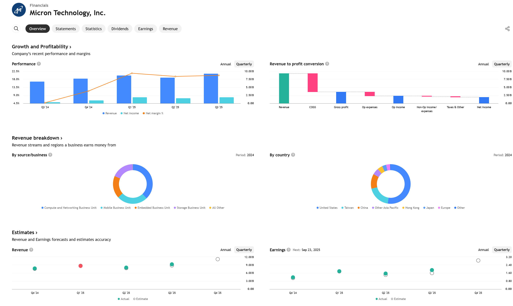
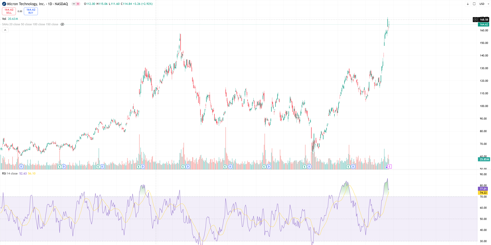
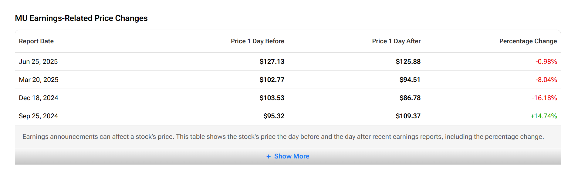
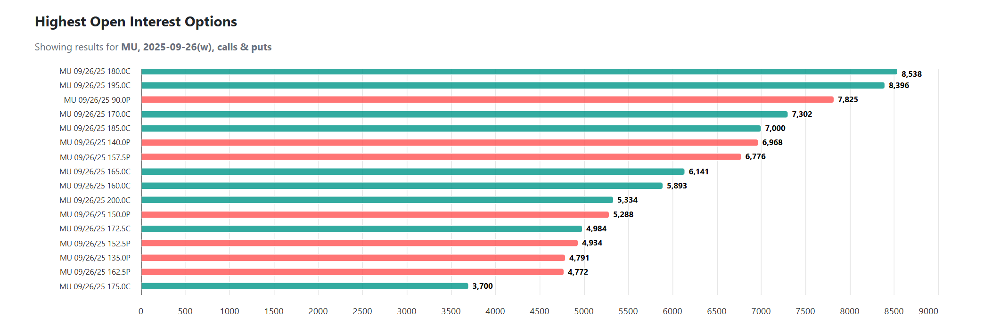
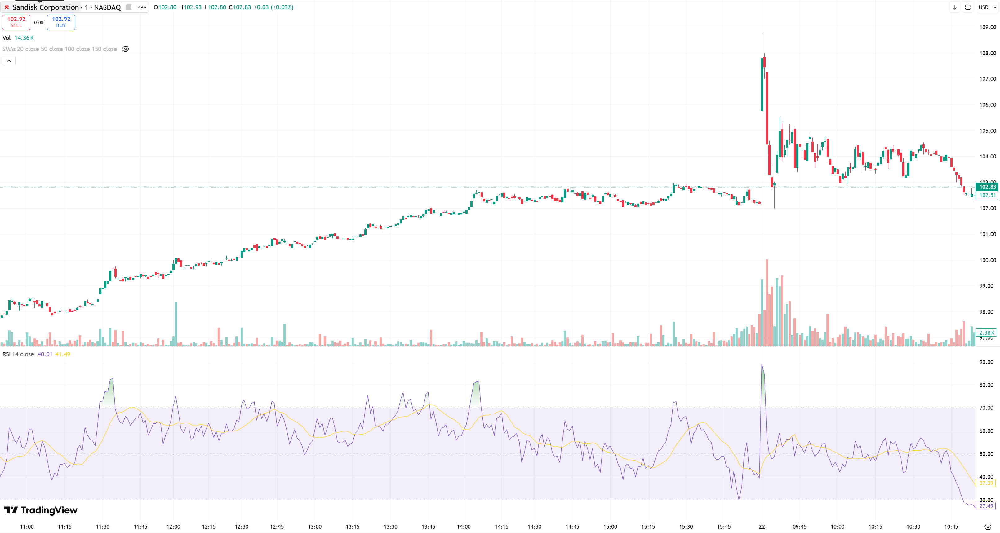

# Stock Logs <!-- omit in toc -->

*Published on 2025-09-22 in [AI](../topics/ai.html)*

- [9/22/2025](#9222025)
  - [MU](#mu)
  - [SNDK](#sndk)

# 9/22/2025

## MU
明天是MU财报，MU过去的财报总体呈现增长，前两次双beats分析师预期。

个人当前持仓：观察仓均价161

MU截至9月22收盘的数据:
Market cap: 186.39B
Trailing PE: 0.19
Forward PE: 13.58
Close: 166

从三个月区间来看，因为暴力拉涨，总体RSI日线和周线偏高，目前已经突破新高。强支撑~140左右。总体还是呈现上涨趋势。

可以看出来前两次虽然双Beats但是股价盘后依旧下跌。如果财报不发挥超常，明天盘后应该依旧下跌。因为当前股价已经把预期price-in了

虽然盘后会跌，但是还是长期看好MU。预计年底达到200/share

大量期权都在190-190 call，当前股价在166，预计应该会全杀掉- -, max pain在166左右，刚好是今天的收盘价

## SNDK
接下来的目标为SNDK，目前AI市场强劲。大部分硬件股票起飞。美光周二盘后财报，我认为指引会给整个存储行业非常大的想象空间

个人当前持仓：0，预计将在明天收盘之前开始建仓，做多SNDK

信息面：trump给中国加了chips curb 中国最大的存储公司长江存储供应链受阻 整体市场supply降低 所以产业其他公司定价权升高

SNDK截至9月22收盘的数据:
Market cap: 15B
Trailing PE: -
Forward PE: 17.78
Close: 102

总体来看股价被低估。

